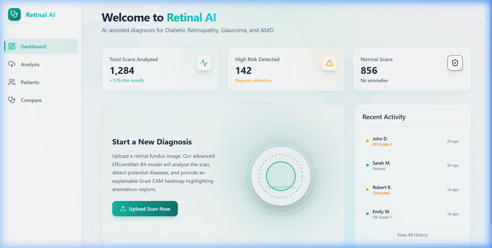
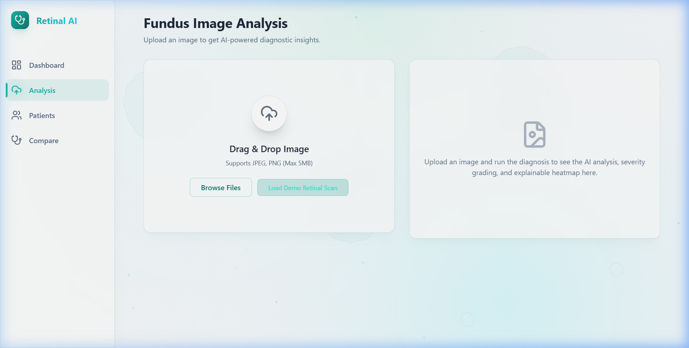
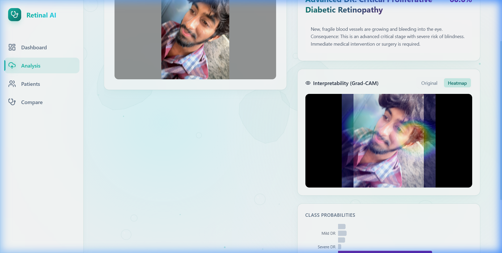
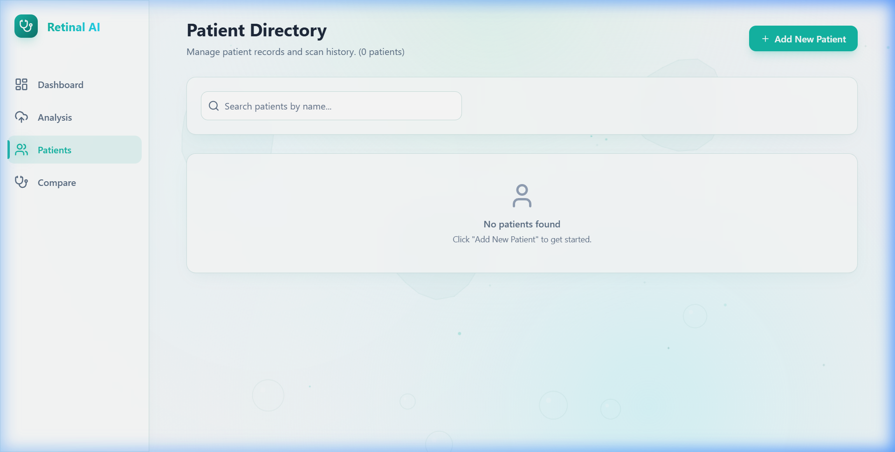
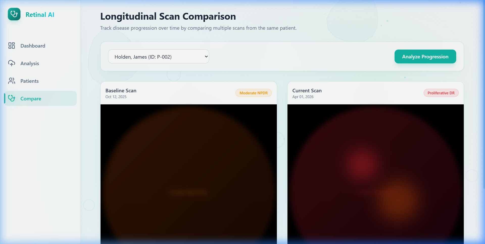
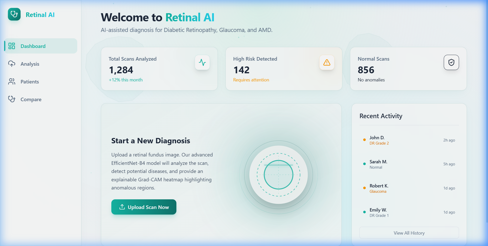
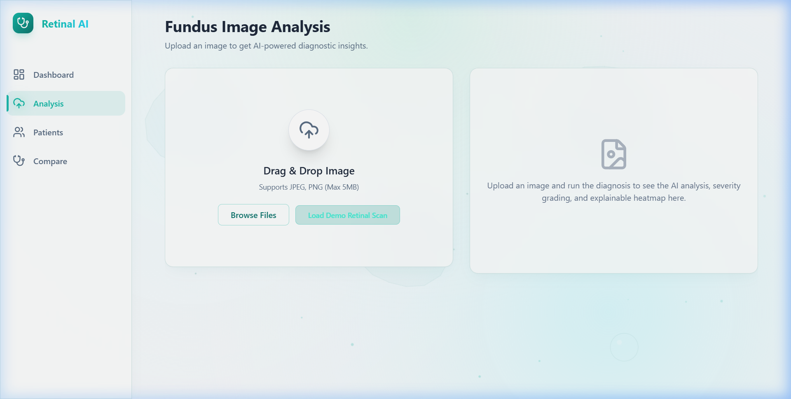

# Retinal Disease Detection AI - Platform Showcase & Diagnostics Gallery

Welcome to the comprehensive showcase for **Retinal AI Diagnostics** — a portfolio-grade medical diagnostics platform powered by deep learning (CNN) to detect diabetic retinopathy, glaucoma, and AMD from retinal fundus images, incorporating explainable AI (Grad-CAM) overlays and fluid glassmorphic UI design.

---

## 🔬 Design Vision & Visual Identity

The interface has been redesigned to reflect a premium, clinical workspace based on the concept of **Living Cells & Fluid Intelligence**.
* **Palette**: Tailored dark-mode accents using Medical Teal, Aqua Blue, Medical Cyan, and Dark Slate.
* **Glassmorphism**: Soft, translucent container cards (`.glass-panel`) with blur filters, subtle teal borders (`rgba(15, 118, 110, 0.16)`), and floating shadows.
* **Ambient Background**: A high-performance, GPU-accelerated HTML5 canvas animation rendering shifting organic gradients, deforming cell membranes, rising fluid bubbles, and floating medical crosses.

---

## 📸 Interface & Diagnostics Gallery

### 1. Unified Clinician Dashboard
The central dashboard provides the clinician with instant metrics (Total Patients, Scans Analyzed, Detected Cases, and System Accuracy), a scan tracking graph, and a list of recent diagnostic activities.

### 2. Fundus Image Upload & AI Analysis
Clinicians can drag-and-drop or browse high-resolution fundus images. An instant pre-flight validation checks file types and resolutions before sending the scan to the inference engine.

### 3. Explainable AI & Diagnostic Output
Once processed, the platform displays the multi-disease classification probabilities alongside the **Grad-CAM Attention Heatmap**. This overlays onto the original fundus scan, highlighting structural pathology (e.g., hemorrhages, hard exudates) to explain the model's prediction.

### 4. Patient Directory & Longitudinal Records
The patient directory allows managing clinical history and viewing records. Clinicians can filter, search, and access full history profiles.

### 5. Longitudinal Scan Comparison & Progression
A comparative split-screen workspace enables tracking pathological progression by loading a patient's historical baseline scan alongside their current scan. This displays differences in severity scores, diagnostic notes, and key metrics.

### 6. Mobile Responsive Diagnostics
The entire UI is fluidly responsive, allowing clinicians to review patient records and check diagnostic reports on tablets or mobile viewports.
<table>
  <tr>
    <td><strong>Mobile Dashboard</strong></td>
    <td><strong>Mobile Scan Upload</strong></td>
  </tr>
  <tr>
    <td></td>
    <td></td>
  </tr>
</table>

---

## 🛠️ Technology & Architecture Stack

* **Deep Learning Model**: PyTorch implementation of `EfficientNet-B4` trained on the APTOS 2019 dataset using Quadratic Weighted Kappa (QWK) optimization.
* **Explainability**: `pytorch-grad-cam` utilizing Grad-CAM to visualize activation weights on the final convolutional layer.
* **Preprocessing Engine**: Custom OpenCV-based crop-and-zoom scripts utilizing CLAHE (Contrast Limited Adaptive Histogram Equalization) for blood vessel visibility enhancement.
* **Backend API**: FastAPI asynchronously serving endpoints, utilizing SQLite/aiosqlite (SQLAlchemy ORM) for database storage and ReportLab for auto-generating PDF clinical reports.
* **Frontend Application**: React + Vite + Tailwind CSS v4 + Framer Motion for high-frame-rate UI animations and glass layout systems.
